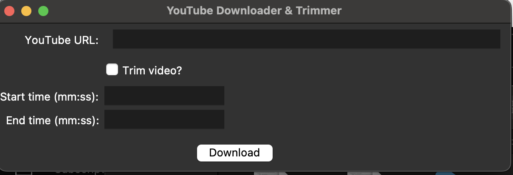
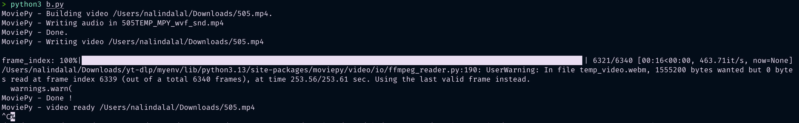

# yt-dlp | youtube Downloader

so basically first setup the venv by:

```sh
source myenv/bin/activate
```

install the dependencies:

```sh
pip3 install moviepy yt_dlp
```


to run a gui:

```sh
python3 clipper.py
```

```sh
MoviePy - Building video /Users/nalindalal/Downloads/505.mp4.
MoviePy - Writing audio in 505TEMP_MPY_wvf_snd.mp4
MoviePy - Done.
MoviePy - Writing video /Users/nalindalal/Downloads/505.mp4

frame_index: 100%|████████████████████████████████████████████████████████████████████████████████████████████████████████████████▋| 6321/6340 [00:16<00:00, 463.71it/s, now=None]/Users/nalindalal/Downloads/yt-dlp/myenv/lib/python3.13/site-packages/moviepy/video/io/ffmpeg_reader.py:190: UserWarning: In file temp_video.webm, 1555200 bytes wanted but 0 bytes read at frame index 6339 (out of a total 6340 frames), at time 253.56/253.61 sec. Using the last valid frame instead.
  warnings.warn(
MoviePy - Done !
MoviePy - video ready /Users/nalindalal/Downloads/505.mp4
```




saves everything to downloads
